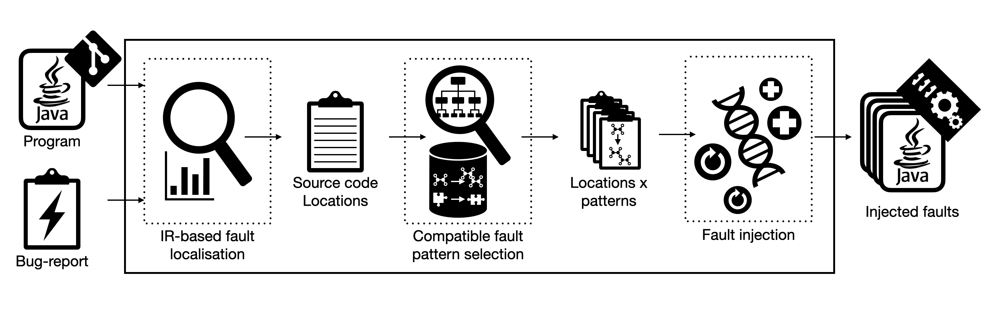

# IBIR: Injecting Bugs based on Information Retrieval.

## Description: 

Source-code base of: IBIR and its experimental evaluation.

IBIR injects bugs in locations similar to ones described in a given bug report, using inverted bug-fixing patterns.

It uses the IRFL from iFixR https://github.com/SerVal-DTF/iFixR
and inverted bug-fixing patterns of TBar https://github.com/SerVal-DTF/TBar. The tbar jar was built from this branch (the version used by iFixR): https://github.com/Ahmedfir/JBugInjector/tree/fix_IOBException_VariableReplace_FP 

The current implementation is a proof of concept of the approach that has been evaluated on bugs from defects4j https://github.com/rjust/defects4j .

A preprint of the approach has been published in arxiv https://www.researchgate.net/publication/346973423_IBIR_Bug_Report_driven_Fault_Injection.

## Setup defects4j bugs:

You need java version 8 , perl and maven. Check the d4j git for more details: https://github.com/rjust/defects4j

On a bash terminal, run:

`./d4j_init.sh`

You should now have:
- a folder `D4J`, where `defects4j` is installed.
- a folder `bugs` under `input/d4j_v2/evaluation/bugs` with details about the d4j bugs.

### checkout d4j project:

To checkout, compile and test a d4j project, call on your terminal the script `checkoutBug.sh`. 
i.e. to checkout the fixed version of `Math-1`, call:

`./checkoutBug.sh PATH/TO/YOUR/JAVA8HOME Math 1 f`

All the checkedout projects with that script will be by default saved under a `projects` folder under `D4J`.

## Compile the project:

It's a simple maven project. You can compile it with `mvn compile` form your terminal or in an IDE like Intellij.

### PS: 
You can use the latest released jar 
available under `release/IBIR-1.1.20-SNAPSHOT-jar-with-dependencies.jar` and run it as a standalone.

## Run the tests:

To run all the tests you will need to checkout the fixed version of `Math-1` as illustrated in "checkout d4j project".

Then you can run the tests from your IDE or the terminal `mvn test`.

## Run the localisation (IRFL) step:

You can find the output of this step under the folder `results/stmtLoc20`.

To reproduce the results of this step, follow the steps in the iFixR repo. 
Make sure that you're applying the localisation on the fixed version and not on the buggy one and that you're using the bug-reports provided by defects4j.

## Run the faults injection step:

We provide a script as an interface to call the injection tool: `d4j_inject.sh`.

This script will checkout the targeted d4j project then inject faults and output the mutation matrix as CSV.

You can adapt the script to your needs.

#### Example: generate 2 mutants semantically similar to the Lang-1's bug.

open the terminal and run:

`bash d4j_inject.sh PATH/TO/YOUR/JAVA8HOME Lang 1 2 PATH/TO/IBIR/stmtLoc/LANG`.

A `logs` folder will be created were you can see all log outputs. 

A `results` folder will be created, containing the mutation matrix and some intermediate steps.

### Results exploitation:

Under `results` you can see progress files and mutation matrices. 

#### Progress files:

The progress files are useful when the injection process is interrupted and restarted. 
For instance, if you followed the previous example, you would have generated 2 mutants for Lang-1. 
If you run that script again to generate 2 mutants, IBIR will recognise that 2 mutants have already been generated and exits.
If you try to generate 5 mutants, IBIR will skip every mutant for which it has already results (compiled and run) and append the next 3 mutants results to the CSV. 

#### Result files:

The results are outputed in a csv where every row corresponds to a mutant.

Here are all the CSV columns.

| Column                                     | Description                                                         |
|--------------------------------------------|---------------------------------------------------------------------|
| prjName                                    | the name of the targeted project i.e. Lang_1 .                      |
| localisationLine                           | the rank of the localisation line (starts from 0 for the 1st one) . |
| confidence                                 | the suspiciousness attributed by the IRFL to the localisation line. |
| patchId                                    | the patch Id.                                                       |
| brokenTestsCount                           | numbre of failing tests by the mutant.                              |
| pattern                                    | fault injection pattern category that induced the mutant.           |
| OchiaiCoef                                 | semantic similarity coefficient to the target bug (between 0 and 1).|
| sameBrokenTestsAsOriginalBug               | mutant breaks the same tests as the original one.                   |
| breaksOnlySubsetOfBrokenTestsByOriginalBug | mutant breaks a subset or same tests as the original one.           |
| brokenTests                                | broken test methods by the mutant.                                  |
| patchObj                                   | Utf-8 base64 encoding of the patch obj.                             |
| duration                                   | duration since the start of execution.                              |

# Next TODOs:

- Generalise the tool.
- Clean and refactor.